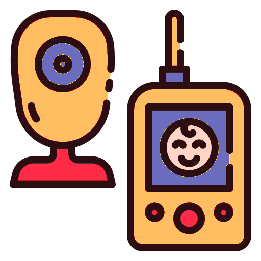

<div style="text-align: center;">

</div>

# Baby Monitor - Server

> !!!\
> The [ui](https://code.sinthu-und-jonas.de/jsa/baby-monitor/ui) project is a good start to display the API provided data.\
> !!!

This projects aims to be the server for my baby monitor. It utilizes [gstreamer](https://gstreamer.freedesktop.org/), [Grove SHT31 Temperature Humidity Sensor](https://github.com/Seeed-Studio/Grove_SHT31_Temp_Humi_Sensor), a simple USB microphone with some python code to provide a video and audio stream with an sensor API to check on our newborn. Additionaly I am using the command line interface for VLC to play some lullabies.

## Instructions

### Raspberry Pi

#### Hardware

I had my old [Snips Voice Interaction Base Kit](https://wiki.seeedstudio.com/Snips_Voice_Interaction_Base_Kit/) laying in one of my drawers, so I reused all this stuff to build this baby monitor. I slightly adjusted the used devices.

- I removed the Relay (had no use for this)
- My set came with a [ReSpeaker 4 Mic Linear Array](https://wiki.seeedstudio.com/ReSpeaker_4-Mic_Linear_Array_Kit_for_Raspberry_Pi/) - but I replaced this with a [simple USB microphone](https://makersportal.com/shop/usb-microphone-for-raspberry-pi); I wanted the microphone be closer to our baby, but the Raspberry Pi further away
- I added the default [Raspberry Pi Camera module](https://projects.raspberrypi.org/en/projects/getting-started-with-picamera)

#### Software

I used the awesome [Raspberry Pi Sleep Monitor](https://github.com/srinathava/raspberry-pi-sleep-monitor) by [Srinathava](https://github.com/srinathava) as a starting point. It covered a lot, actually a little bit more then I needed. So I adjusted it.

I am using the drivers for the [seeed-voicecard](https://github.com/HinTak/seeed-voicecard), the [Grove sensors](https://github.com/Seeed-Studio/grove), command line tools for VLC. Checkout the [install script](./install.sh) for more details. Gstream provides the camera stream. Twisted is used to build the API.

Everyting is running directly on the Raspberry Pi - no container or any kind of virtualization.

### API

The server itself provides six API endpoints. VLC provides an endpoint to access the audio stream:

#### Camera

The camera can be accessed under `http://<your-local-ip>:8080/stream.mjpeg`.
It provides a stream of images provided by Gstreamer.

#### Audio

> TODO

#### Single Picture

If you want a single picture and always the latest one, this can be accessed under `http://<your-local-ip>:8080/latest.jpeg`.

#### Climate

> TODO

#### Lullabies

> TODO

#### Healthcheck

The server provides a simple healthcheck endpoint. Either you will have a result or none :P

```json
{
  status: "up"
}
```

You can request the status under `http://<your-local-ip>:8080/healthcheck`.

## Author

| [](https://code.sinthu-und-jonas.de/jonas-schubert) |
| :---------------------------------------------------------------------------------------------------------------------------------------: |
| [Jonas Schubert](https://code.sinthu-und-jonas.de/jonas-schubert) |

## License

`Baby Monitor - Server` is distributed under the MIT license. [See LICENSE](LICENSE) for details.

```
MIT License

Copyright (c) 2022 Jonas Schubert

Permission is hereby granted, free of charge, to any person obtaining a copy
of this software and associated documentation files (the "Software"), to deal
in the Software without restriction, including without limitation the rights
to use, copy, modify, merge, publish, distribute, sublicense, and/or sell
copies of the Software, and to permit persons to whom the Software is
furnished to do so, subject to the following conditions:

The above copyright notice and this permission notice shall be included in all
copies or substantial portions of the Software.

THE SOFTWARE IS PROVIDED "AS IS", WITHOUT WARRANTY OF ANY KIND, EXPRESS OR
IMPLIED, INCLUDING BUT NOT LIMITED TO THE WARRANTIES OF MERCHANTABILITY,
FITNESS FOR A PARTICULAR PURPOSE AND NONINFRINGEMENT. IN NO EVENT SHALL THE
AUTHORS OR COPYRIGHT HOLDERS BE LIABLE FOR ANY CLAIM, DAMAGES OR OTHER
LIABILITY, WHETHER IN AN ACTION OF CONTRACT, TORT OR OTHERWISE, ARISING FROM,
OUT OF OR IN CONNECTION WITH THE SOFTWARE OR THE USE OR OTHER DEALINGS IN THE
SOFTWARE.
```
